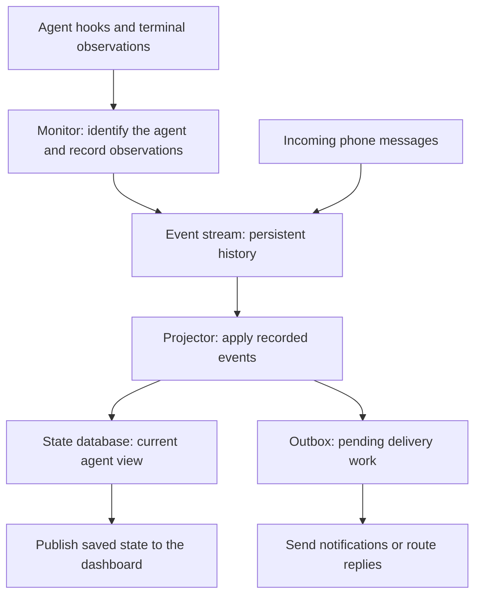

# Harold Architecture

Harold helps you follow agents working in tmux: see which ones are busy, read what they are working on, receive completion notifications, and send replies from your phone back to an agent.

The agents run in their own tmux panes. Harold runs as a background service that observes them and handles messages. The terminal dashboard, `tmx-agent-dash`, is a separate program that asks Harold for the current agent states.

## Follow one task

Suppose an agent is idle and you submit “Fix the login error.” With lifecycle hooks configured, the update reaches the dashboard like this:

1. The agent's start hook tells Harold that work has begun and supplies the task text. A **hook** is a small integration that reports an agent action.
2. Harold checks which agent process is running in that pane and records the observation in its persistent history.
3. Harold reads the recorded observation and updates its stored view of that agent to `Busy`, with the submitted instruction available as its work summary.
4. After saving that view, Harold publishes it to the dashboard. The dashboard can now show `Busy` and “Fix the login error.”

When the agent finishes, a completion hook can report its reply. Harold updates the agent to `Idle` and separately considers whether to notify you. Finishing a turn does not by itself prove the requested fix succeeded.

This flow has two useful records: **what Harold observed**, and **what Harold currently knows about each agent**. Keeping the observations lets Harold rebuild the current view after a restart.

## The main components

The following diagram shows how observations become dashboard state and how messages lead to delivery work. These are responsibilities inside Harold; they are not separate services.

The **monitor** checks running processes, accepts hook reports, and reads terminal evidence. It handles agent observations one at a time so competing inputs cannot independently overwrite the current state.

The **event stream** stores accepted observations and messages in order. The `events` library supplies this storage inside the Harold process; it does not require another service.

The **projector** reads that history and updates the application database. For agent observations, a set of decision rules called the **reducer** determines the resulting state. The projector saves that state along with its position in the history, called a **checkpoint**. This records how far it has processed.

The **outbox** is a persistent list of delivery work, such as sending a completion notification or forwarding a phone reply. The projector stages that work in the same database transaction as its state updates and checkpoint. Actual delivery happens afterward, so a retryable channel failure can remain pending without undoing the recorded event.

The **snapshot publisher** sends the saved agent view to clients through the `WatchAgentStates` gRPC API. A snapshot is the complete current view. The dashboard receives one when it connects, followed by updated snapshots, so it can reconnect without reconstructing every change it missed.

See the [monitor reference](../references/agent-monitor/README.md#projection-and-storage) for the storage and API contracts.

## Why the monitor uses several sources

A start hook may say an agent is busy while its terminal still displays the previous idle screen. Later, a completion hook might be missed even though the terminal clearly shows the agent waiting for input. Harold needs rules for both situations.

Each source answers a different question:

| Source | What it tells Harold | Limitation |
| --- | --- | --- |
| Process inventory | Which agent process is present in each pane | Presence alone does not establish Busy or Idle |
| Lifecycle hooks | The agent explicitly started or finished work | Hooks can be missed |
| Provider screen adapters | The visible terminal matches a configured Busy or Idle marker | The terminal can be stale, ambiguous, or changed by a provider update |

A **screen adapter** interprets the terminal format used by a particular agent. It returns observations for the monitor to record; it does not edit the current-state database.

After a hook fires, Harold gives the terminal a short grace period to repaint. During that period, the hook wins. Afterward, conclusive screen evidence can correct stale state. An unreadable or inconclusive screen preserves earlier evidence; without any conclusive evidence, the state is `Unknown`. CPU use and elapsed silence do not determine Busy or Idle.

Recording the evidence before applying these rules makes the result reproducible. A failed capture does not erase known state, and replaying the same history applies the same decisions. The [reconciliation contract](../references/agent-monitor/README.md#reconciliation-contract) defines the exact timing and precedence rules.

## Identity before state

Suppose an agent exits and you launch another in the same tmux pane. The pane still exists, but the new agent must not inherit the old agent's Busy state or task description.

Harold therefore identifies the pane together with the agent process, its start time, and its provider. This combination is called an **incarnation**. Process start time matters because the operating system can reuse a process ID.

A replacement starts at `Unknown` with no work summary. Recorded events belonging to an older incarnation remain in history but cannot change the new incarnation's current view. The [identity reference](../references/agent-monitor/README.md#incarnation-identity) lists the exact fields.

## Keeping the task description useful

Busy/Idle answers “Is it working?” The work summary answers “What is it working on?” Those values can change independently. An idle agent can keep the description of its last task, and Harold can learn a task description even when screen state is inconclusive.

Hooks supply task text directly. Screen adapters can recover submitted instructions when hooks miss them. Harold keeps these sources separately and normally uses the most recent meaningful instruction. Idle prompts such as “Ask Codex to do anything” do not replace a task description.

When optional activity summarization is enabled, a background Claude request turns the available instruction and completion reply into a short description. Monitoring continues while it runs, and the source instruction remains available if generation fails. A result is accepted only while it still matches the same agent incarnation and activity, so a slow response cannot replace a newer task's description.

A generated description summarizes supplied evidence; it does not independently verify an agent's reported outcome. Generation also does not send notifications. See [activity summaries](../references/agent-monitor/activity-summaries.md) for the evidence limits and [work-summary rules](../references/agent-monitor/README.md#work-summaries) for selection and clearing behavior.

## Recovering a submitted task from scrollback

A submitted instruction may scroll out of view before Harold reads it. For supported terminal formats, Harold can look through a bounded history tail to recover it. Busy/Idle classification continues to use the visible screen.

Old history creates an identity problem: text already in a pane may belong to a previous agent. On its first successful history capture, Harold records a baseline of prompt fingerprints—compact identifiers for recognizing the same submitted blocks—without adopting any existing prompt as new work. Later captures must establish continuity with that baseline before newly submitted text becomes eligible. If continuity is lost, Harold establishes another baseline.

This deliberately sacrifices some recovery: if Harold attaches after a task has begun, it may never recover that task from scrollback. The benefit is that retained pane history cannot silently become a replacement agent's task.

Raw terminal captures stay inside capture and parsing. Only eligible, sanitized, bounded instructions can become stored summary evidence; raw captures are never stored, logged, published to clients, or sent to the summarizer. Parsing support varies by provider. The [screen-adapter reference](../references/agent-monitor/screen-adapters.md) covers supported formats, unsent drafts, baselines, and recovery limits.

## Notifications and phone replies

A completion notification and an agent-state update serve different purposes. The dashboard needs an updated view even when you are already looking at the agent and no notification is needed.

A `TurnCompleted` event creates delivery work in the outbox. The delivery handler checks the configured notification rules and desktop state, then either skips the notification, speaks it at the desk, or sends it through the configured away channel, iMessage or Telegram. Retryable delivery failures remain pending.

For a phone reply, the channel listener records an `InboundMessageReceived` event. The delivery handler resolves a live agent pane using the message's routing tag or the configured routing fallbacks, checks that an agent is still present, and submits the message to that pane through tmux.

Ordinary agent observations and generated dashboard descriptions do not create notification work. The [notification reference](../references/notification/README.md) and [inbound routing reference](../references/inbound-message-routing/README.md) describe channel decisions, routing, and failure behavior.

## Startup, restart, and shutdown

On a fresh installation, Harold creates its state database with the complete current schema. Before accepting client traffic, it catches the stored view up to the event history. It then loads the complete saved snapshot and starts publishing. A dashboard cannot connect halfway through that recovery and receive a partially rebuilt view.

Persistent observations, projected state, and accepted generated descriptions survive restart. Temporary work, such as pending description requests and scrollback fingerprints, does not. History capture establishes a fresh baseline when monitoring resumes.

During shutdown, Harold signals its background tasks to stop, closes dashboard streams, and lets in-flight requests drain. Monitoring has a bounded stop period. Already committed events and state remain available on the next start.

See the [startup and shutdown sequence](../references/agent-monitor/README.md#startup-reconnect-and-shutdown) for the precise recovery behavior. To connect agents to Harold, follow [Set up agent monitor hooks](../how-tos/setup-agent-monitor-hooks.md).
