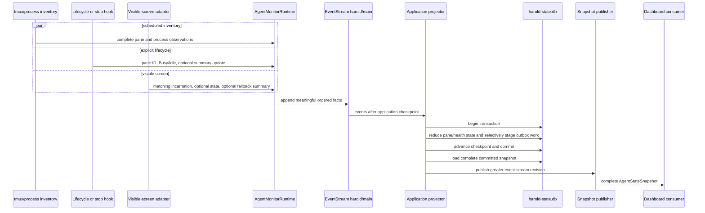
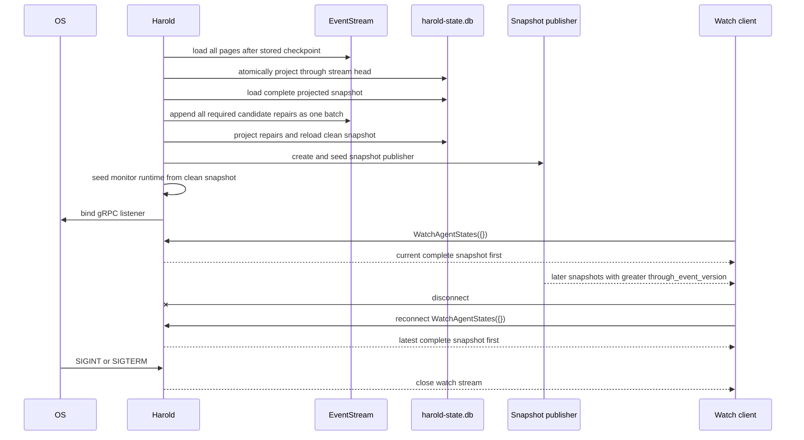

# Agent Monitor Reference

The agent monitor discovers configured agent processes in tmux, records lifecycle and visible-screen observations, projects current pane state, and serves complete snapshots over gRPC.

## Problem

A pane name does not answer whether its current agent process is busy, idle, or newly replaced. Operators need concrete answers to questions such as: which process does this row describe, which input wins when a hook and the terminal disagree, what survives a restart, and what does a reconnecting consumer receive? They also need those answers without storing terminal history or exposing raw pane content.

## Architecture

The monitor has one durable write path and one current-state projection path.

```text
┌──────────────────────────────┐
│ Acquisition adapters         │
└──────────────┬───────────────┘
               │ typed observations
               v
┌──────────────────────────────┐
│ AgentMonitorRuntime          │
└──────────────┬───────────────┘
               │ ordered append
               v
┌──────────────────────────────┐
│ EventStream: harold/main     │
└──────────────┬───────────────┘
               │ version order
               v
┌──────────────────────────────┐
│ Application projector        │
└──────────────┬───────────────┘
               │ atomic commit
               v
┌──────────────────────────────┐
│ harold-state.db              │
└──────────────┬───────────────┘
               │ complete snapshot
               v
┌──────────────────────────────┐
│ WatchAgentStates consumers   │
└──────────────────────────────┘
```

Inventory, screen capture, and lifecycle adapters produce typed inputs. `AgentMonitorRuntime` serializes agent-event decisions, deduplicates observations only after successful append, and revalidates departure. The application projector reads durable events in stream-version order and is the only writer of the current projection. The snapshot publisher distributes committed database state; it is not a second state store.

### Incarnation identity

Every pane-scoped agent event identifies the complete current agent incarnation:

| Field | Meaning |
| --- | --- |
| `pane_id` | tmux pane ID, such as `%22` |
| `pane_pid` | Long-lived pane-root process ID |
| `agent_pid` | Selected configured agent process ID |
| `agent_started_at_ms` | OS-reported agent-process start time |
| `provider_id` | Named provider ID, or `unknown` for an ambiguous/legacy match |

Any change creates a new incarnation. A replacement begins at `Unknown` with no lifecycle state, screen state, explicit summary, or fallback summary. Events for a different incarnation remain in history but are ignored by the current projection.

## Interaction diagrams

### Observation, projection, and publication



### Startup, reconnect, and shutdown



## Durable event contract

Agent events use the existing ordered `harold/main` `EventStream`. Append batches are atomic at the event-stream boundary.

| Event | Durable fields | Projection effect |
| --- | --- | --- |
| `AgentPaneObserved` | Pane metadata, provider display data, full incarnation, observation time | Inserts or refreshes the matching pane. A new incarnation replaces the row and starts `Unknown` with empty evidence. |
| `AgentPaneDeparted` | Full incarnation, observation time | Removes the row only when the full incarnation still matches. |
| `AgentLifecycleObserved` | Full incarnation, `Busy`/`Idle`, adapter ID, `Unchanged`/`Clear`/`Set` summary update, observation time | Updates matching hook evidence and explicit-summary candidate. |
| `AgentScreenObserved` | Full incarnation, optional `Busy`/`Idle`, optional normalized fallback summary, classifier ID, observation time | Applies each present fact independently. An absent field preserves its candidate. |
| `AgentWorkSummaryCandidatesRepaired` | Full incarnation, independent explicit/screen clear flags, typed `ConfiguredIdlePlaceholder` reason, observation time | Clears only the marked legacy candidate and its timestamp, then recomputes the effective summary. |
| `AgentMonitorHealthChanged` | Component, healthy/degraded flag, bounded reason code, observation time | Upserts health for the component. |
| `TurnCompleted` | Existing five notification fields plus optional resolved incarnation and `Unchanged`/`Set` completion summary update | Always preserves notification behavior; a matching resolved incarnation also supplies idle evidence and a non-destructive summary update. |

`ReportAgentState` resolves the current incarnation and appends `AgentPaneObserved` immediately before `AgentLifecycleObserved` in one batch. A resolved `TurnComplete` appends `AgentPaneObserved` immediately before `TurnCompleted`. An unresolved completion still appends `TurnCompleted` for notification but does not alter agent state.

Repeated inventory metadata and unchanged screen outputs do not append events. A screen event is appended when either its state or fallback summary is a meaningful changed value; both fields do not need to be present.

## Reconciliation contract

### State

1. Inventory owns presence. A pane is departed only after two complete successful scans omit it and a fresh lookup confirms the exact incarnation is no longer current.
2. A lifecycle observation supplies `Busy` or `Idle` and clears the prior screen-state epoch.
3. Lifecycle state wins during `agent_monitor.hook_grace_ms` after the observation.
4. At or after grace, a conclusive screen observation can replace the effective lifecycle state.
5. Within one visible grid, a matching busy clause wins over a matching idle clause.
6. Inconclusive screen state preserves existing evidence. With no conclusive lifecycle or screen evidence, effective state is `Unknown`.
7. `last_transition_at_ms` changes only when effective state changes.

The runtime retains a conflicting screen state during grace only as an acquisition result; it does not append that state until a post-grace sample still shows it. Later identical samples are deduplicated within that lifecycle epoch. Summary changes remain independent and can append during hook grace.

### Work summaries

Harold keeps an explicit candidate and a provider-screen candidate for each incarnation, with durable internal observation timestamps. The most recently observed substantive candidate is the effective `work_summary`; explicit wins an equal-timestamp tie. A new incarnation starts with neither.

| Input | Value | Explicit-summary effect |
| --- | --- | --- |
| `ReportAgentState.work_summary` | Absent | Preserve (`Unchanged`) |
| `ReportAgentState.work_summary` | Present, normalizes to empty | Clear explicit candidate; reveal fallback if one exists |
| `ReportAgentState.work_summary` | Present, normalizes non-empty and is not an exact configured idle placeholder | Set explicit candidate |
| `ReportAgentState.work_summary` | Exact normalized configured idle placeholder | Preserve (`Unchanged`) before event serialization |
| `TurnComplete.last_user_prompt` | Normalizes to empty | Preserve (`Unchanged`) because legacy proto3 cannot distinguish absent from empty |
| `TurnComplete.last_user_prompt` | Normalizes non-empty and is not an exact configured idle placeholder | Set explicit candidate when the completion resolves to the current incarnation |
| `TurnComplete.last_user_prompt` | Exact normalized configured idle placeholder | Clear the legacy raw prompt and preserve (`Unchanged`) before event serialization |
| Visible-screen fallback | Inconclusive | Preserve prior fallback |
| Visible-screen fallback | Changed, substantive | Replace the screen candidate; it becomes effective when newer than the explicit candidate |

All summary inputs pass through the same terminal sanitizer. It removes C0 and C1 controls and complete ESC control sequences, collapses Unicode whitespace to single spaces, trims the result, and truncates it to 160 Unicode scalar values. Screen acquisition and the runtime defense reject only exact equality with a normalized configured idle fragment; a substantive prompt that merely mentions the placeholder remains valid. A conclusive state from the same observation remains usable, and placeholder/absence does not refresh or clear the prior screen candidate.

### Legacy candidate repair

Current rejection cannot remove a placeholder already accepted into durable history by an older binary. At startup, Harold first projects every historical event page without creating the snapshot hub or monitor runtime. It then checks the complete stored explicit and screen candidates for each named provider. Exact configured placeholders produce `AgentWorkSummaryCandidatesRepaired` with independent `clear_explicit` and `clear_screen` flags.

The repair carries no rejected summary text. It applies only to the complete current incarnation, clears each marked candidate together with its timestamp, and uses the normal timestamp rule to select anything that remains. All pane repairs are collected into one event-stream append, projected completely, and reloaded before Harold creates the hub or runtime seed. An append or projection failure aborts startup; an all-false or stale-incarnation repair is ignored.

New exact placeholders need no compensating repair. Lifecycle `Set` and completion input use only the matching provider's fragments when the incarnation names a currently configured provider. If the provider ID is missing, `unknown`, or no longer configured, Harold conservatively compares against every configured provider's fragments. An exact match becomes `Unchanged` before event serialization; completion also clears the legacy raw prompt. Another provider's placeholder remains legitimate for a known provider, and text that merely contains a placeholder remains substantive. Because no ingress/repair pair exists, a 500-event projector page cannot expose an intermediate placeholder.

Because the repair is durable and projection-only, deleting and rebuilding `harold-state.db` from the event stream preserves the correction without creating delivery work. A legitimate containing prompt, such as `Explain why the UI says Ask Codex to do anything`, does not equal the configured placeholder and survives replay.

The public API exposes one optional effective summary. When it is absent, the dashboard—not Harold—owns the exact display copy `No work summary reported`.

## Projection and storage

Migration `003_agent_monitor_projection` adds two checksum-tracked tables to `<store.path>/harold-state.db`:

| Table | Contents |
| --- | --- |
| `agent_panes` | Pane/display metadata, full incarnation, hook and screen evidence, explicit and fallback summary candidates with internal timestamps, effective state/summary, last transition, and last event version |
| `agent_monitor_health` | Component, healthy flag, bounded reason code, observation time, and last event version |

The state database uses WAL mode, `synchronous = NORMAL`, and a five-second busy timeout. For each projection batch, Harold opens one immediate transaction, applies agent rows, stages only externally deliverable events, advances `last_processed_event`, and commits. An error rolls the whole transaction back.

Only `TurnCompleted`, `InboundMessageReceived`, and unknown event types are staged in the delivery outbox. Agent observation, summary-repair, and monitor-health events are projection-only. Unknown event types remain visible to the existing permanent-delivery failure path instead of being silently skipped.

After commit, Harold loads the checkpoint, health, and panes with one query and publishes the complete snapshot if its `through_event_version` is greater than the in-memory revision. A revision can advance because of a non-agent event while pane content remains unchanged.

## gRPC contract

The canonical schema is `harold-api/proto/harold.proto`. The service exposes exactly these methods:

| Method | Request | Response semantics |
| --- | --- | --- |
| `TurnComplete` | Existing five scalar fields: `pane_id = 1`, `pane_label = 2`, `last_user_prompt = 3`, `assistant_message = 4`, `main_context = 5` | Unary `accepted = true` after durable append. Existing field numbers are unchanged. |
| `ReportAgentState` | `pane_id = 1`, `state = 2`, `adapter_id = 3`, `optional work_summary = 4` | Unary `accepted = true` after the pane-plus-lifecycle batch is durably appended. Projection may follow asynchronously. |
| `WatchAgentStates` | Empty request | Server stream whose first message is the complete current snapshot, followed by complete snapshots at greater revisions. There is no cursor. |

`ReportAgentState.state` accepts only `AGENT_STATE_BUSY` and `AGENT_STATE_IDLE`. Pane IDs have the tmux `%` plus decimal-digits form. Adapter and configured provider IDs match `[a-z0-9][a-z0-9._-]{0,63}`; provider ID `unknown` is reserved.

### `AgentStateSnapshot`

| Field | Type | Meaning |
| --- | --- | --- |
| `through_event_version = 1` | `uint64` | Highest durable event version included in the projection |
| `server_time_ms = 2` | `int64` | Snapshot load time |
| `monitor_health = 3` | repeated `AgentMonitorHealth` | Current component health |
| `panes = 4` | repeated `AgentPaneState` | Current live agent incarnations |

`AgentMonitorHealth` contains `component = 1`, `state = 2`, `reason_code = 3`, and `observed_at_ms = 4`.

`AgentPaneState` contains:

| Field | Number | Type |
| --- | ---: | --- |
| `pane_id` | 1 | `string` |
| `tmux_target` | 2 | `string` |
| `session_name` | 3 | `string` |
| `window_index` | 4 | `uint32` |
| `pane_index` | 5 | `uint32` |
| `pane_pid` | 6 | `uint32` |
| `agent_pid` | 7 | `uint32` |
| `agent_started_at_ms` | 8 | `int64` |
| `provider_id` | 9 | `string` |
| `provider_display_name` | 10 | `string` |
| `working_directory` | 11 | `string` |
| `state` | 12 | `AgentState` (`Busy`, `Idle`, or `Unknown`) |
| `last_transition_at_ms` | 13 | `int64` |
| `work_summary` | 14 | `optional string` |

The pane message does not expose adapter IDs, classifier IDs, evidence provenance, raw screen text, internal summary timestamps, or search behavior. The service has no search RPC or query field. Consumers perform search locally over the snapshots they already hold.

### RPC failure statuses

| Condition | Status |
| --- | --- |
| `ReportAgentState` has an invalid/unknown state, malformed pane ID, or malformed adapter ID | `INVALID_ARGUMENT` |
| The pane does not resolve to a live configured agent incarnation | `FAILED_PRECONDITION` |
| Inventory acquisition, durable append, or monitor runtime is unavailable | `UNAVAILABLE` |
| `TurnComplete` durable append fails | `INTERNAL` |

## Configuration

Default monitor configuration:

```toml
[agent_monitor]
inventory_interval_ms = 1000
screen_interval_ms = 500
hook_grace_ms = 2000

[[agents]]
id = "codex"
display_name = "Codex"
command_contains = ["codex"]
busy_all = ["Working", "esc to interrupt"]
idle_all = ["Ask Codex to do anything"]
summary_line_prefixes = ["›"]
```

| Key | Constraint and behavior |
| --- | --- |
| `agent_monitor.inventory_interval_ms` | Positive integer; scheduled inventory period |
| `agent_monitor.screen_interval_ms` | Positive integer; scheduled visible-screen period |
| `agent_monitor.hook_grace_ms` | Non-negative lifecycle precedence period |
| `agents[].id` | Unique bounded identifier; `unknown` is reserved |
| `agents[].display_name` | Non-empty display label |
| `agents[].command_contains` | At least one non-empty fragment; any fragment matches case-insensitively |
| `agents[].busy_all` | Optional conjunctive, case-sensitive visible-grid fragments |
| `agents[].idle_all` | Optional conjunctive, case-sensitive visible-grid fragments and idle-placeholder rejection clauses |
| `agents[].summary_line_prefixes` | Optional exact, case-sensitive line prefixes used to acquire one bottom-most fallback candidate |

Process selection prefers a matching process in the pane TTY's foreground process group. Otherwise it selects the shallowest matching descendant of the pane root, with PID as a deterministic tie-breaker. Multiple named provider matches produce provider `unknown` rather than choosing configuration order. Missing trustworthy process start time degrades inventory and does not create an incarnation.

The shipped named defaults cover Codex, Claude, and OpenCode state markers. Codex and Claude also define visible-screen summary prefixes. OpenCode deliberately defines no `summary_line_prefixes`: its prompt and submitted-message rows cannot be safely distinguished by the configured visible prefix, so screen acquisition supplies state but no fallback summary. Its opt-in lifecycle plugin can still send explicit summaries.

Legacy configuration remains loadable:

```toml
[agents]
command_contains = ["claude", "codex"]
```

Harold logs a deprecation warning for this form. It is presence-only: matched agents use provider `unknown`, and named provider screen classification and fallback extraction are unavailable until the configuration is migrated to `[[agents]]`.

## Privacy and field bounds

The screen adapter invokes `tmux capture-pane` for an already identified pane using a non-negative start offset and holds the captured visible text only inside that adapter. It returns a typed observation containing the full incarnation, optional state, optional normalized fallback summary, classifier ID, and time. Raw capture content is not stored or logged, including on capture failure.

Before durable append or publication, tmux-derived metadata is terminal-sanitized and bounded:

| Value | Maximum Unicode scalar values |
| --- | ---: |
| tmux target, session name, provider display name | 256 |
| working directory | 1024 |
| work summary | 160 |
| health component | 64 ASCII identifier bytes |
| health reason code | 160 ASCII identifier bytes |

## Health and failure behavior

The public snapshot reports `inventory` and `screen` health after a component first degrades or subsequently changes/recoveries. Initial success does not create a health row. Repeated identical health is deduplicated.

| Reason code | Source |
| --- | --- |
| `command_unavailable` | Required inventory command is absent |
| `command_failed` | Inventory command exits unsuccessfully |
| `malformed_output` | Inventory output cannot be parsed completely |
| `missing_start_time` | A selected agent process lacks trustworthy start time |
| `capture_unavailable` | Screen-capture command is absent |
| `capture_failed` | Screen capture exits unsuccessfully |
| `pane_departed` | Pane disappears during capture |
| `timeout` | Acquisition exceeded the bounded deadline or a prior acquisition still owns its gate |
| `task_failed` | The bounded acquisition worker could not start or return |
| `ok` | Recovery to healthy |

An inventory failure preserves current panes and never infers mass departure. A screen failure preserves lifecycle state and the prior fallback. Projector failures leave the checkpoint and projection unchanged and are retried by the event-handler loop. A startup catch-up, repair append/projection, or snapshot-load error prevents the server from becoming ready.

## Lifecycle limits

- `WatchAgentStates` is snapshot-then-stream, not cursor replay. Slow consumers may coalesce obsolete in-memory snapshots; reconnecting restores the latest complete state.
- Provider screen markers are version-sensitive configuration, not semantic understanding. Inconclusive text is preserved as uncertainty.
- Harold does not infer busy/idle from CPU use, tmux window activity, or elapsed silence.
- Harold does not navigate tmux for the dashboard and does not implement dashboard search.
- The OpenCode lifecycle plugin is opt-in and is not installed by `make deploy`; its screen provider has no fallback-summary prefix.
- The legacy `TurnComplete` path remains a notification ingress. Empty legacy prompts preserve summaries and cannot explicitly clear them.
- A store containing `AgentWorkSummaryCandidatesRepaired` is forward-compatible with the current binary, but an older binary does not know that event type and would route it through the unknown-delivery path.

For operational registration and verification, see [Set up agent monitor hooks](../../how-tos/setup-agent-monitor-hooks.md). For rationale, see [Harold Architecture](../../explanations/architecture.md).
