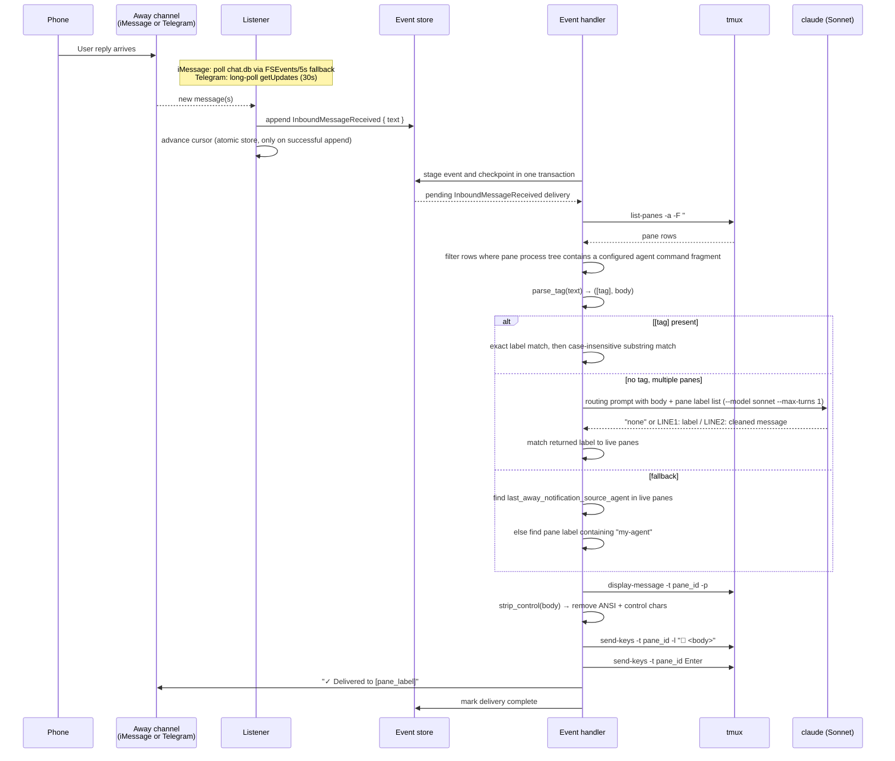

# Inbound Message Routing

Inbound message routing routes messages from your phone (via iMessage or Telegram, depending on the configured away channel) to the correct agent session running in a tmux pane.

## Problem

Messaging from your phone means you know which agent you meant but the message arrives as plain text with no session context. With multiple agent sessions running, there is no obvious way to get your message to the right one.

## Architecture

Routing has two stages: inbound collection and routing resolution.

**Inbound collection** — The listener is channel-specific, selected by `[notify] away_channel`:

**iMessage** — Watches `chat.db` for filesystem changes (via FSEvents on macOS) and runs two separate queries on each change, each with its own ROWID cursor. A 5-second fallback poll ensures messages are still detected if the filesystem watcher is unavailable:

- **Inbound** — `handle_id IN (handle_ids) AND is_from_me = 0` — messages sent by the user from the recipient's device
- **Self** — `handle_id IN (handle_ids) AND is_from_me = 1` — messages sent from the user's phone that appear as self-sent rows in chat.db

Each cursor is advanced only after a successful `append_inbound_message`, so a crash before the append causes the message to be reprocessed on the next poll rather than skipped.

**Telegram** — Long-polls the Telegram Bot API `getUpdates` endpoint (30s timeout). On startup, drains any pre-existing updates to avoid replaying old messages. Only messages from the configured `chat_id` are processed; messages starting with `🤖` (Harold's own messages) are filtered out.

**Routing resolution** — Harold's event handler stages `InboundMessageReceived` events in its durable outbox and calls `route_inbound_message()` in stream-version order. Live pane discovery runs at resolution time via `tmux list-panes -a`, then reads the process tree under each pane's `pane_pid`. A pane is considered an agent when the pane process or a descendant process command contains one of the configured `[agents].command_contains` fragments. Agents are addressed via the `AgentAddress` enum (currently only `TmuxPane { pane_id, label }`).

## Pane discovery

Harold currently recognizes a pane as an agent when the pane process or one of its descendants has a process command containing a configured fragment:

- Default `[agents].command_contains`: `["claude", "codex"]`
- Claude Code example: tmux may report `pane_current_command` as a Node-version-like process, but the pane's descendant command includes `claude`
- Codex example: tmux may report `pane_current_command` as `codex-aarch64-a`, while the pane's descendant command includes `codex`

This is a process-name heuristic. Update `[agents].command_contains` if an agent binary name changes. A future improvement is explicit pane registration via the `TurnComplete` RPC.

Pane label format: `<session_name>:<window_index>.<pane_index>` (e.g. `alir-app main:0.1`).

## Routing resolution

```
route_inbound_message(text)
│
├─ parse_tag(text) → ([tag], body)
│
├─ tag present?
│   ├─ exact match on pane label → use it
│   └─ substring match (case-insensitive) → use it
│       └─ no match → return None (error iMessage)
│
├─ no tag → semantic_resolve(body, panes)
│   ├─ only 1 pane → skip (returns None, falls through)
│   └─ multiple panes → AI CLI (Sonnet, --max-turns 1, disableAllHooks)
│       prompt asks: "does this message have EXPLICIT routing intent?"
│       ├─ response = "none" → return None
│       └─ response = LINE1: pane label / LINE2: cleaned message → match by label
│
├─ last_away_notification_source_agent → find AgentAddress in live panes
│
└─ my-agent fallback → find pane whose label contains "my-agent"
```

## Delivery

Once a pane is resolved:

1. `is_pane_alive(pane_id)` — re-checks `tmux display-message -t <pane_id> -p #{pane_pid}` and the descendant process table to confirm the pane still hosts a known agent process
2. `strip_control(text)` — removes ANSI escape sequences and non-newline control characters
3. `tmux send-keys -t <pane_id> -l "📱 <body>"` — sends text literally (no shell interpretation)
4. `tmux send-keys -t <pane_id> Enter` — submits the message
5. Confirmation sent back via the configured away channel: `"✓ Delivered to [<pane_label>]"`

If either tmux `send-keys` command fails, the outbox delivery remains pending for retry. A confirmation failure after tmux accepts the message is logged but does not retry the agent delivery, which avoids duplicating the user's input. If no pane is found, an error message listing the currently available pane labels is sent back via the away channel and the event is recorded as intentionally skipped.

## Semantic routing prompt

The AI CLI is invoked with Sonnet (`--max-turns 1`, `--settings '{"disableAllHooks":true}'`) with this prompt structure:

```
You are a routing classifier. Do NOT answer or respond to the message content.

MESSAGE TO CLASSIFY:
<message>
<body (with </message> tags stripped for injection prevention)>
</message>

ACTIVE TMUX PANES:
- <label1>
- <label2>

Pane labels use hyphens where users may write spaces (e.g. 'my agent' refers to 'my-agent').
Does the message contain EXPLICIT routing intent to a specific pane?
(direct address like 'To X,', 'ask X', '[X]', 'my agent')
If yes, reply on two lines:
LINE1: exact pane label
LINE2: message with routing prefix removed
If no explicit routing intent, reply: none
```

The message body is wrapped in `<message>` tags with `</message>` occurrences stripped to prevent prompt injection. The cleaned message from LINE2 is what gets relayed to the pane, stripping any routing prefix the user included.

## Sequence


