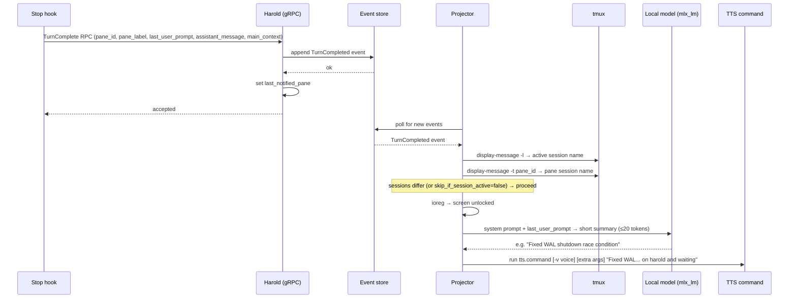
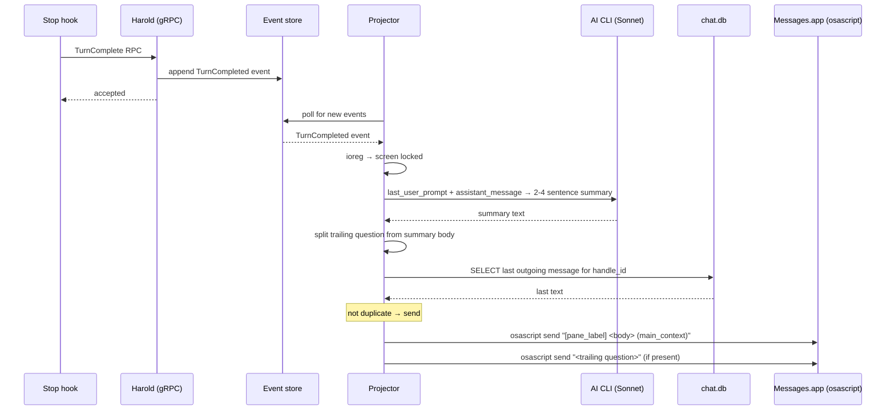

# Notification

Notification notifies the user of completed agent turns, via voice when at the desk or iMessage when away.

## Problem

AI agents finish turns silently. Without active monitoring you won't know a task is done until you look — which breaks flow at your desk and leaves agents idle when you're away.

## Architecture

The projector consumes `TurnCompleted` events from the event store and drives the notification decision. Summarisation is offloaded to a local model or the AI CLI depending on the notification path.

```
TurnCompleted event
       │
       ▼
  ┌─────────────────────────────────────────────┐
  │              notify()                       │
  │                                             │
  │  skip_if_session_active?                    │
  │  ├─ yes, session active → skip              │
  │  └─ no                                      │
  │       │                                     │
  │       ▼                                     │
  │  screen locked?                             │
  │  ├─ no  → notify_at_desk()                  │
  │  └─ yes → notify_away()                     │
  └─────────────────────────────────────────────┘
         │                      │
         ▼                      ▼
  local model (mlx_lm)     AI CLI (Sonnet)
  short summary            detailed summary
         │                      │
         ▼                      ▼
    TTS command            osascript
    (configurable)         (iMessage)
```

## Sequence: at desk



## Sequence: away (screen locked)



## Decision flow

1. `skip_if_session_active = true` (default) — skip if the user is already in the active tmux session
2. Screen unlocked — TTS via configurable command with a short AI-generated summary
3. Screen locked — iMessage with a detailed AI-generated summary

## TTS (at desk)

- Summary generated by a local model (`mlx_lm`) if configured; falls back to `"Work complete"`
- TTS command, voice, and extra args are all configurable via `[tts]` in config

## iMessage (away)

- Summary generated by the AI CLI (Sonnet); falls back to the first 280 chars of the assistant message
- A trailing question in the summary is split into a separate follow-up message
- Duplicate suppression: skips send if the last outgoing message to the recipient is identical
- Message format: `[pane_label] <summary> (main_context)`
