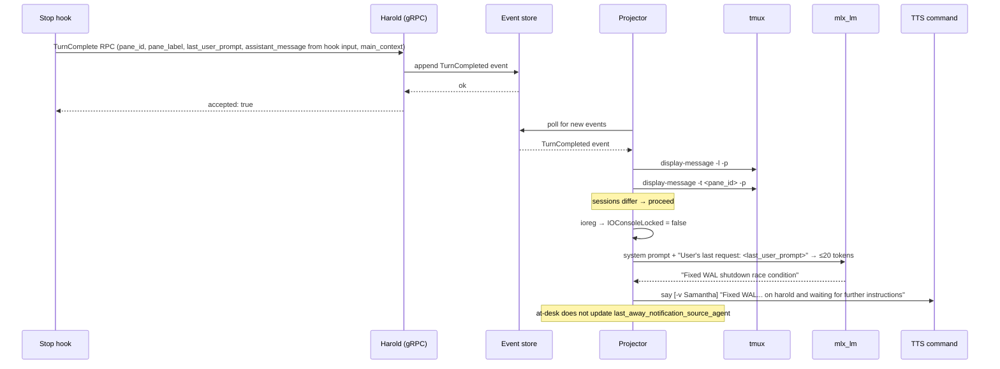
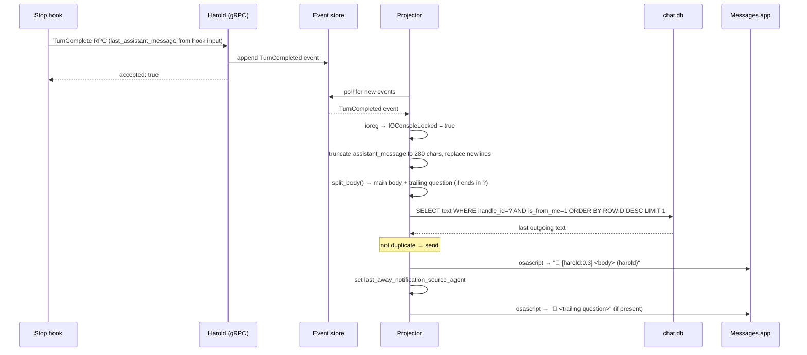

# Notification

Notification notifies the user of completed agent turns, via voice when at the desk or iMessage when away.

## Problem

AI agents finish turns silently. Without active monitoring you won't know a task is done until you look — which breaks flow at your desk and leaves agents idle when you're away.

## Architecture

The projector consumes `TurnCompleted` events and calls `notify()`. The notification path is chosen based on two runtime checks: whether the user's tmux session is active, and whether the screen is locked.

Summarisation uses different backends depending on the path:

| Path            | Summary backend                  | Max input                     | Output                                            |
| --------------- | -------------------------------- | ----------------------------- | ------------------------------------------------- |
| At desk (TTS)   | Local model (`mlx_lm`)           | 500 chars of last_user_prompt | 3–8 words, ≤20 tokens                             |
| Away (iMessage) | First 280 chars of assistant_message | 280 chars assistant message   | `[pane_label] body (context)` + trailing question  |

If the local model is not configured, the TTS summary falls back to `"Work complete"`.

## Decision flow

```
TurnCompleted event
       │
       ▼
  notify()
  │
  ├─ skip_if_session_active = true?
  │   └─ tmux display-message -l → MRU client session
  │      tmux display-message -t pane_id → pane session
  │      same session → skip (return)
  │
  ├─ ioreg → IOConsoleLocked = true?
  │   ├─ no  → notify_at_desk()
  │   └─ yes → notify_away()
```

## At-desk: TTS

1. `build_short_summary()` — runs `uv run mlx_lm.generate` in `ai.local_model_dir` with a system prompt asking for a 3–8 word completion summary; strips `<think>...</think>` blocks from reasoning models
2. Message assembled: `"<summary> on <main_context> and waiting for further instructions"`
3. TTS command run: `<tts.command> [tts.args...] [-v tts.voice] "<message>"`

Config keys (`[tts]`):

| Key       | Description                                               |
| --------- | --------------------------------------------------------- |
| `command` | TTS binary (e.g. `say`)                                   |
| `voice`   | Optional voice name passed as `-v`                        |
| `args`    | Optional extra args prepended before `-v` and the message |

## Away: iMessage

1. First 280 characters of `assistant_message` extracted, newlines replaced with spaces
2. `split_body()` — splits the last sentence ending in `?` into a separate follow-up message
3. Message assembled: `[<pane_label>] <main body> (<main_context>)`
4. Duplicate check — queries `chat.db` for the most recent outgoing message to first configured handle ID; skips if identical (after stripping `🤖` prefix)
5. Messages sent via AppleScript: `tell application "Messages" to send "🤖 ..." to buddy "..."`
6. Trailing question (if present) sent as a second `🤖`-prefixed message

Config keys (`[imessage]`):

| Key          | Description                                                          |
| ------------ | -------------------------------------------------------------------- |
| `recipient`  | Phone number or email of the iMessage recipient                      |
| `handle_ids` | All `chat.db` handle IDs for your Apple ID (dedup and inbound poll)  |

## Sequences

### At desk



### Away (screen locked)


