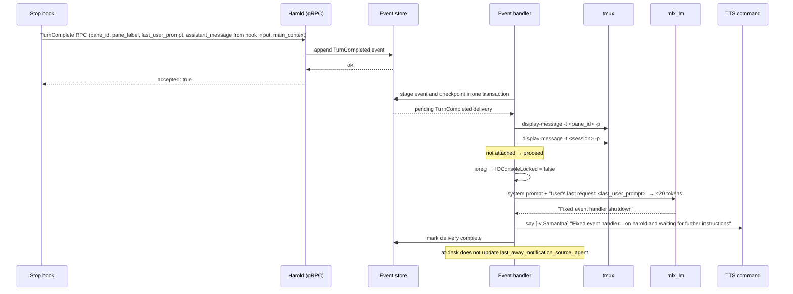
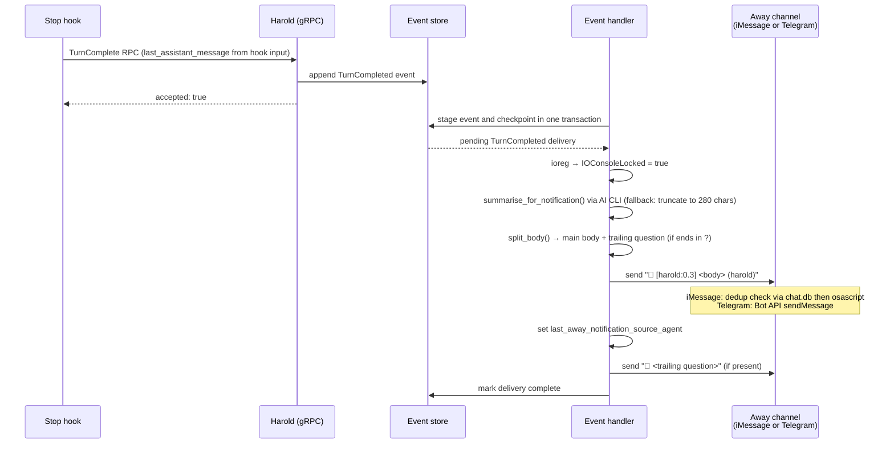

# Notification

Notification notifies the user of completed agent turns, via voice when at the desk or the configured away channel (iMessage or Telegram) when away.

## Problem

AI agents finish turns silently. Without active monitoring you won't know a task is done until you look — which breaks flow at your desk and leaves agents idle when you're away.

## Architecture

Harold's event handler stages `TurnCompleted` events in its durable outbox and calls `notify()` in stream-version order. Successful deliveries and intentional skips are marked complete. TTS command, Telegram HTTP/configuration, and iMessage process failures remain pending for retry. Malformed payloads and unknown event types are recorded as terminal failures so one poison event cannot block later work. The notification path is chosen based on runtime checks: whether the completing pane's tmux session has an attached client, whether the completing pane is the one the user is looking at, and whether the screen is locked.

Summarisation uses different backends depending on the path:

| Path              | Summary backend                      | Max input                     | Output                                            |
| ----------------- | ------------------------------------ | ----------------------------- | ------------------------------------------------- |
| At desk (TTS)     | Local model (`mlx_lm`)               | 500 chars of last_user_prompt | 3–8 words, ≤20 tokens                             |
| Away (iMessage)   | AI CLI or 280-char truncation        | Full assistant_message         | `🤖 [pane_label] body (context)` + trailing question |
| Away (Telegram)   | AI CLI or 280-char truncation        | Full assistant_message         | `🤖 [pane_label] body (context)` + trailing question |

If the local model is not configured, the TTS summary falls back to `"Work complete"`.

## Decision flow

```
TurnCompleted event (pane_id from $TMUX_PANE in stop hook)
       │
       ▼
  notify()
  │
  ├─ skip_if_session_active = true?
  │   └─ tmux display-message -t <session> -p #{session_attached}
  │      attached ≠ 0 → skip (return)
  │
  ├─ skip_if_pane_active = true?
  │   └─ ioreg → screen unlocked?
  │      tmux display-message -t <session> -p #{pane_id} → active pane
  │      active pane == completing pane → skip (return)
  │
  ├─ ioreg → IOConsoleLocked = true?
  │   ├─ no  → notify_at_desk()
  │   └─ yes → channels::notify_away() (iMessage or Telegram per config)
```

`<session>` is resolved from the completing pane via `tmux display-message -t <pane_id> -p #{session_name}`.

## At-desk: TTS

1. `build_short_summary()` — runs `uv run mlx_lm.generate` in `ai.local_model_dir` with a system prompt asking for a 3–8 word completion summary; strips `<think>...</think>` blocks from reasoning models
2. Message assembled: `"<summary> on <main_context> and waiting for further instructions"`
3. TTS command run: `<tts.command> [tts.args...] [-v tts.voice] "<message>"`
4. If the primary command fails to start or exits non-zero, Harold runs the fallback command when configured: `<tts.fallback_command> [tts.fallback_args...] [-v tts.fallback_voice] "<message>"`

Config keys (`[tts]`):

| Key                | Description                                               |
| ------------------ | --------------------------------------------------------- |
| `command`          | TTS binary (e.g. `say`)                                   |
| `voice`            | Optional voice name passed as `-v`                        |
| `args`             | Optional extra args prepended before `-v` and the message |
| `fallback_command` | Optional backup TTS binary when `command` fails           |
| `fallback_voice`   | Optional fallback voice name passed as `-v`               |
| `fallback_args`    | Optional fallback args prepended before `-v` and message  |

## Away: iMessage or Telegram

The away channel is selected by `[notify] away_channel` (`"imessage"` or `"telegram"`). Both channels share the same notification flow and prefix all outgoing messages with `🤖`. This serves two purposes:

- **Inbound filtering** — the listener skips messages starting with `🤖` so Harold doesn't route its own notifications back to agents as user replies
- **Visual distinction** — on your phone you can immediately tell which messages are from Harold vs from you

### Common steps (both channels)

1. `summarise_for_notification()` — uses AI CLI to summarise `assistant_message` into 2–3 sentences under 280 chars; falls back to `truncate_body()` (first 280 chars, newlines flattened)
2. `split_body()` — splits the last sentence ending in `?` into a separate follow-up message
3. Message assembled: `🤖 [<pane_label>] <main body> (<main_context>)`
4. Trailing question (if present) sent as a second `🤖`-prefixed message

### iMessage-specific

5. Duplicate check — queries `chat.db` for the most recent outgoing message to first configured handle ID; skips if identical (after stripping `🤖` prefix)
6. Messages sent via AppleScript: `tell application "Messages" to send "🤖 ..." to buddy "..."`

Config keys (`[imessage]`):

| Key          | Description                                                          |
| ------------ | -------------------------------------------------------------------- |
| `recipient`  | Phone number or email of the iMessage recipient                      |
| `handle_ids` | All `chat.db` handle IDs for your Apple ID (dedup and inbound poll)  |

### Telegram-specific

5. Messages sent via Telegram Bot API `sendMessage` to the configured chat ID

Config keys (`[telegram]`):

| Key         | Description                                |
| ----------- | ------------------------------------------ |
| `bot_token` | Telegram bot token from @BotFather         |
| `chat_id`   | Numeric chat ID for the notification chat  |

## Sequences

### At desk


```mermaid
sequenceDiagram
    participant Hook as Stop hook
    participant gRPC as Harold (gRPC)
    participant Store as Event store
    participant Handler as Event handler
    participant Tmux as tmux
    participant LocalModel as mlx_lm
    participant TTS as TTS command

    Hook->>gRPC: TurnComplete RPC (pane_id, pane_label, last_user_prompt, assistant_message from hook input, main_context)
    gRPC->>Store: append TurnCompleted event
    Store-->>gRPC: ok
    gRPC-->>Hook: accepted: true

    Handler->>Store: stage event and checkpoint in one transaction
    Store-->>Handler: pending TurnCompleted delivery
    Handler->>Tmux: display-message -t <pane_id> -p #{session_name} → session
    Handler->>Tmux: display-message -t <session> -p #{session_attached} → attached?
    note over Handler: not attached → proceed
    Handler->>Handler: ioreg → IOConsoleLocked = false
    Handler->>LocalModel: system prompt + "User's last request: <last_user_prompt>" → ≤20 tokens
    LocalModel-->>Handler: "Fixed event handler shutdown"
    Handler->>TTS: say [-v Samantha] "Fixed event handler... on harold and waiting for further instructions"
    Handler->>Store: mark delivery complete
    note over Handler: at-desk does not update last_away_notification_source_agent
```

### Away (screen locked)


```mermaid
sequenceDiagram
    participant Hook as Stop hook
    participant gRPC as Harold (gRPC)
    participant Store as Event store
    participant Handler as Event handler
    participant Channel as Away channel<br/>(iMessage or Telegram)

    Hook->>gRPC: TurnComplete RPC (last_assistant_message from hook input)
    gRPC->>Store: append TurnCompleted event
    gRPC-->>Hook: accepted: true

    Handler->>Store: stage event and checkpoint in one transaction
    Store-->>Handler: pending TurnCompleted delivery
    Handler->>Handler: ioreg → IOConsoleLocked = true
    Handler->>Handler: summarise_for_notification() via AI CLI (fallback: truncate to 280 chars)
    Handler->>Handler: split_body() → main body + trailing question (if ends in ?)
    Handler->>Channel: send "🤖 [harold:0.3] <body> (harold)"
    note over Channel: iMessage: dedup check via chat.db then osascript<br/>Telegram: Bot API sendMessage
    Handler->>Handler: set last_away_notification_source_agent
    Handler->>Channel: send "🤖 <trailing question>" (if present)
    Handler->>Store: mark delivery complete
```
