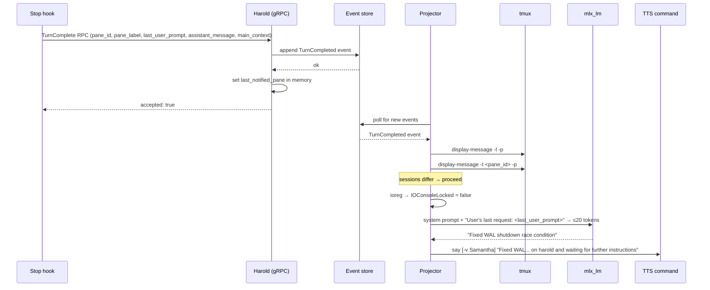
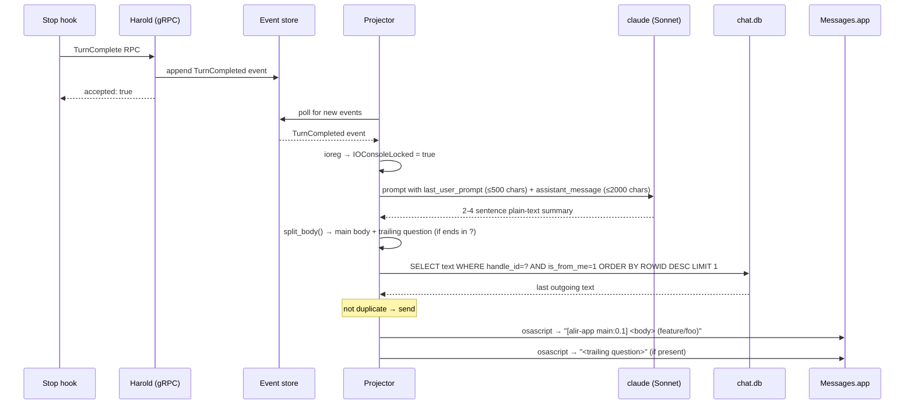

# Notification

Notification notifies the user of completed agent turns, via voice when at the desk or iMessage when away.

## Problem

AI agents finish turns silently. Without active monitoring you won't know a task is done until you look — which breaks flow at your desk and leaves agents idle when you're away.

## Architecture

The projector consumes `TurnCompleted` events and calls `notify()`. The notification path is chosen based on two runtime checks: whether the user's tmux session is active, and whether the screen is locked.

Summarisation uses different backends depending on the path:

| Path | Summary backend | Max input | Output |
|------|----------------|-----------|--------|
| At desk (TTS) | Local model (`mlx_lm`) | 500 chars of last_user_prompt | 3–8 words, ≤20 tokens |
| Away (iMessage) | AI CLI (`claude --model sonnet`) | 500 chars prompt + 2000 chars assistant message | 2–4 sentences, plain text |

If the local model is not configured, the TTS summary falls back to `"Work complete"`. If the AI CLI fails, the iMessage body falls back to the first 280 characters of the assistant message.

## Decision flow

```
TurnCompleted event
       │
       ▼
  notify()
  │
  ├─ skip_if_session_active = true?
  │   └─ tmux display-message -l → MRU client session
  │      tmux display-message -t pane_id → pane session
  │      same session → skip (return)
  │
  ├─ ioreg → IOConsoleLocked = true?
  │   ├─ no  → notify_at_desk()
  │   └─ yes → notify_away()
```

## At-desk: TTS

1. `build_short_summary()` — runs `uv run mlx_lm.generate` in `ai.local_model_dir` with a system prompt asking for a 3–8 word completion summary; strips `<think>...</think>` blocks from reasoning models
2. Message assembled: `"<summary> on <main_context> and waiting for further instructions"`
3. TTS command run: `<tts.command> [tts.args...] [-v tts.voice] "<message>"`

Config keys (`[tts]`):

| Key | Description |
|-----|-------------|
| `command` | TTS binary (e.g. `say`) |
| `voice` | Optional voice name passed as `-v` |
| `args` | Optional extra args prepended before `-v` and the message |

## Away: iMessage

1. `build_detailed_summary()` — runs AI CLI with a prompt asking for a 2–4 sentence plain-text summary covering what was done, current status, and whether a decision is needed; uses up to 500 chars of `last_user_prompt` and 2000 chars of `assistant_message`
2. `split_body()` — splits the last sentence ending in `?` into a separate follow-up message
3. Duplicate check — queries `chat.db` for the most recent outgoing message to `handle_id`; skips if identical
4. Messages sent via AppleScript: `tell application "Messages" to send "..." to buddy "..."`
5. Message format: `[<pane_label>] <main body> (<main_context>)` then `<question>` as a second message if present

Config keys (`[imessage]`):

| Key | Description |
|-----|-------------|
| `recipient` | Phone number or email of the iMessage recipient |
| `handle_id` | `handle_id` in `chat.db` for dedup and inbound polling |
| `extra_handle_ids` | Additional handle IDs to poll (e.g. multiple devices) |

## Sequences

### At desk



### Away (screen locked)


