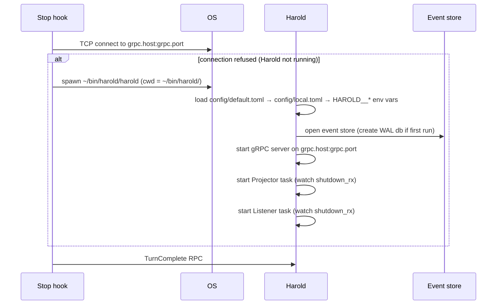
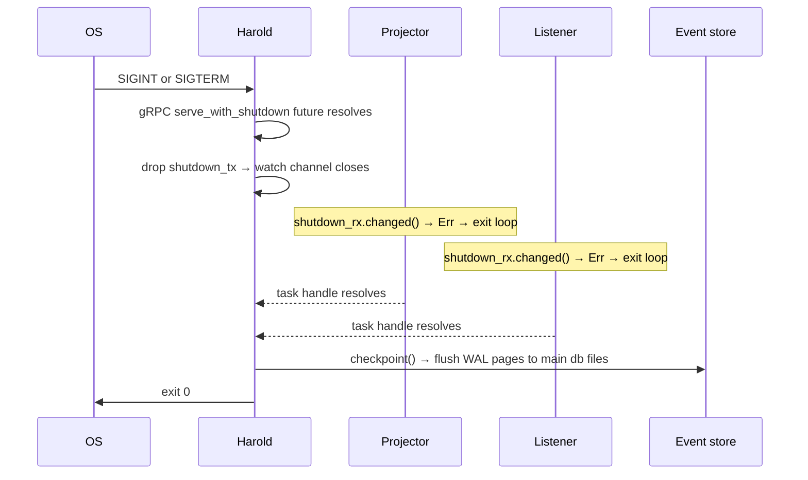

# Operation

Operation covers how Harold is started, configured, and shut down.

## Problem

Harold needs to be running whenever an agent turn completes, but manually starting a daemon before every session is fragile and easy to forget.

## Architecture

Harold runs as a single binary with three concurrent tasks sharing an event store via a `tokio::sync::watch` shutdown channel. The agent stop hook is responsible for ensuring Harold is alive before calling it.

| Task        | Responsibility                                                                                       |
| ----------- | ---------------------------------------------------------------------------------------------------- |
| gRPC server | Accepts `TurnComplete` RPCs, appends `TurnCompleted` events                                          |
| Projector   | Tails the event store; dispatches `TurnCompleted` → `notify()` and `ReplyReceived` → `route_reply()` |
| Listener    | Watches `chat.db` via FSEvents (5 s fallback poll) using separate inbound/self cursors; appends `ReplyReceived` events |

The shutdown channel is a `watch::Sender<()>`. Dropping the sender (on SIGINT/SIGTERM) closes the channel; all receivers (`Projector`, `Listener`) see `Err(RecvError)` and exit their loops.

```
  ┌────────────────────────────────────────────────────┐
  │                      Harold                        │
  │                                                    │
  │  ┌─────────────┐  ┌────────────┐  ┌─────────────┐  │
  │  │ gRPC server │  │ Projector  │  │  Listener   │  │
  │  │             │  │            │  │             │  │
  │  │ TurnComplete│  │ TurnComple-│  │ watches     │  │
  │  │ RPC handler │  │ ted →      │  │ chat.db     │  │
  │  │             │  │ notify     │  │ (FSEvents)  │  │
  │  │             │  │            │  │             │  │
  │  │             │  │ ReplyRecei-│  │             │  │
  │  │             │  │ ved →      │  │             │  │
  │  │             │  │ route_reply│  │             │  │
  │  └──────┬──────┘  └─────┬──────┘  └──────┬──────┘  │
  │         │               │                │         │
  │         └───────────────┴────────────────┘         │
  │                         │                          │
  │                   Event store                      │
  └────────────────────────────────────────────────────┘
```

## Startup

The stop hook detects Harold via a TCP connect to `host:port` (configured in `[grpc]`). If the connect fails, it spawns `~/bin/harold/harold` with the working directory set to `~/bin/harold/` so the binary finds `config/` and its event store without any environment variables.

Config is loaded in layers on startup:

1. `config/default.toml` — shipped defaults, always required
2. `config/local.toml` — personal overrides, optional (not committed to git)
3. `HAROLD__<SECTION>__<KEY>` environment variables — highest priority, e.g. `HAROLD__IMESSAGE__RECIPIENT`

Config directory defaults to `config/` next to the running binary (`current_exe()` parent). Override with `HAROLD_CONFIG_DIR`.

## Shutdown

SIGINT or SIGTERM triggers an ordered shutdown:

1. gRPC server stops accepting new connections (in-flight RPCs complete)
2. `shutdown_tx` is dropped, closing the `watch` channel
3. `Projector` and `Listener` observe channel close and exit
4. `projector_handle.await` and `listener_handle.await` join both tasks
5. WAL checkpoint — flushes all WAL pages to the main database files so the next open is clean

The WAL checkpoint must run after all tasks exit because it requires exclusive database access.

## Diagnostics

```
harold --diagnostics [--delay N]
```

Runs without starting the daemon. Prints the current config, then tests:

1. Screen lock detection (`ioreg`)
2. TTS notification (`notify_at_desk` with a dummy turn)
3. iMessage notification (`notify_away` with a dummy turn, if screen locked)

`--delay N` sleeps N seconds before running (default 10 when `--delay` is given without a value) — allows time to lock the screen to test the away path.

## Sequences

### Startup



### Shutdown


