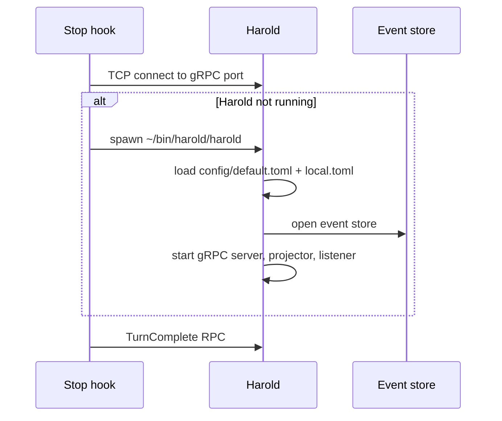
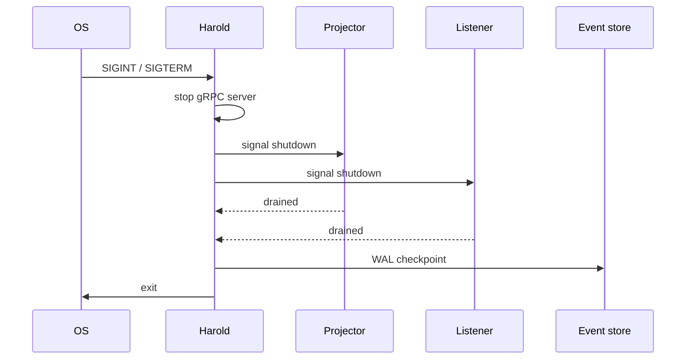

# Operation

Operation covers how Harold is started, configured, and shut down.

## Problem

Harold needs to be running whenever an agent turn completes, but manually starting a daemon before every session is fragile and easy to forget.

## Architecture

Harold runs as a single binary with three concurrent tasks sharing an event store. The agent stop hook is responsible for ensuring Harold is alive before calling it.

```
  ┌────────────────────────────────────────────────────┐
  │                      Harold                        │
  │                                                    │
  │  ┌─────────────┐  ┌────────────┐  ┌─────────────┐  │
  │  │ gRPC server │  │ Projector  │  │  Listener   │  │
  │  │             │  │            │  │             │  │
  │  │ TurnComplete│  │ TurnComple-│  │ polls       │  │
  │  │ RPC handler │  │ ted →      │  │ chat.db     │  │
  │  │             │  │ notify     │  │ every 5s    │  │
  │  │             │  │            │  │             │  │
  │  │             │  │ ReplyRecei-│  │             │  │
  │  │             │  │ ved →      │  │             │  │
  │  │             │  │ route_reply│  │             │  │
  │  └──────┬──────┘  └─────┬──────┘  └──────┬──────┘  │
  │         │               │                │         │
  │         └───────────────┴────────────────┘         │
  │                         │                          │
  │                   Event store                      │
  └────────────────────────────────────────────────────┘
```

## Sequence: startup



## Sequence: shutdown



## Starting Harold

The agent stop hook starts Harold automatically if it is not running. Harold is detected via a TCP connect to the configured gRPC port.

Harold is deployed to `~/bin/harold/` and run from that directory so it finds `config/` and the event store without any environment variables.

## Diagnostics

```
harold --diagnostics [--delay N]
```

Tests screen lock detection, TTS, and iMessage config. `--delay N` waits N seconds before running (default 10 if `--delay` is given without a value) — useful for locking the screen before the test fires.

## Configuration

Config is loaded in layers:

1. `config/default.toml` — shipped defaults
2. `config/local.toml` — personal overrides (not committed)
3. `HAROLD__*` environment variables — highest priority

The config directory defaults to `config/` next to the binary. Override with `HAROLD_CONFIG_DIR`.

## Shutdown

Send SIGINT or SIGTERM. Harold drains in-flight tasks then checkpoints the WAL before exiting.
