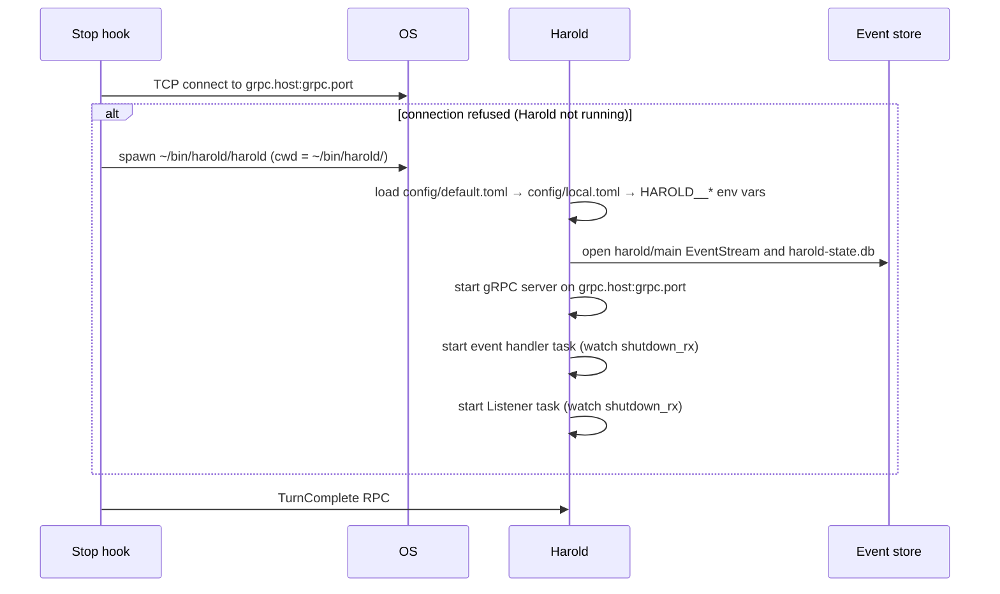
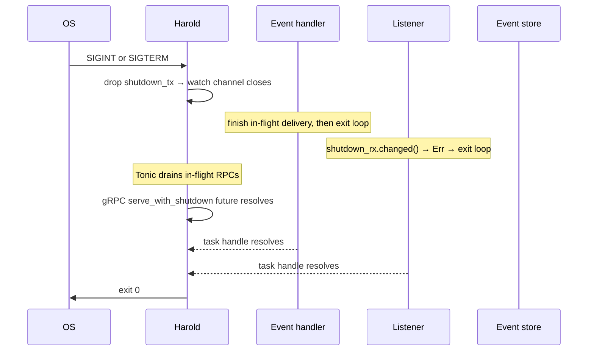

# Operation

Operation covers how Harold is started, configured, and shut down.

## Problem

Harold needs to be running whenever an agent turn completes, but manually starting a daemon before every session is fragile and easy to forget.

## Architecture

Harold runs as a single binary with three concurrent tasks sharing an event store via a `tokio::sync::watch` shutdown channel. The agent stop hook is responsible for ensuring Harold is alive before calling it.

| Task        | Responsibility                                                                                       |
| ----------- | ---------------------------------------------------------------------------------------------------- |
| gRPC server | Accepts `TurnComplete` RPCs, appends `TurnCompleted` events                                          |
| Event handler | Stages ordered events into a durable outbox; dispatches `TurnCompleted` → `notify()` and `InboundMessageReceived` → `route_inbound_message()` |
| Listener    | Channel-specific inbound listener: iMessage watches `chat.db` via FSEvents (5s fallback poll) with separate inbound/self cursors; Telegram long-polls Bot API `getUpdates`. Both append `InboundMessageReceived` events |

The shutdown channel is a `watch::Sender<()>`. Dropping the sender (on SIGINT/SIGTERM) closes the channel; the event handler and listener exit their loops. An in-flight blocking delivery completes before the handler exits.

```
  ┌────────────────────────────────────────────────────┐
  │                      Harold                        │
  │                                                    │
  │  ┌─────────────┐  ┌────────────┐  ┌─────────────┐  │
  │  │ gRPC server │  │  Handler   │  │  Listener   │  │
  │  │             │  │            │  │             │  │
  │  │ TurnComplete│  │ TurnComple-│  │ watches     │  │
  │  │ RPC handler │  │ ted →      │  │ chat.db     │  │
  │  │             │  │ notify     │  │ (FSEvents)  │  │
  │  │             │  │            │  │             │  │
  │  │             │  │ InboundMsg │  │             │  │
  │  │             │  │ → route    │  │             │  │
  │  └──────┬──────┘  └─────┬──────┘  └──────┬──────┘  │
  │         │               │                │         │
  │         └───────────────┴────────────────┘         │
  │                         │                          │
  │           EventStream + Harold state DB            │
  └────────────────────────────────────────────────────┘
```

## Startup

The stop hook detects Harold via a TCP connect to `host:port` (configured in `[grpc]`). If the connect fails, it spawns `~/bin/harold/harold` with the working directory set to `~/bin/harold/` so the binary finds `config/` and its event store without any environment variables.

Config is loaded in layers on startup:

1. `config/default.toml` — shipped defaults, always required
2. `config/local.toml` — personal overrides, optional (not committed to git)
3. `HAROLD__<SECTION>__<KEY>` environment variables — highest priority, e.g. `HAROLD__IMESSAGE__RECIPIENT`

Config directory defaults to `config/` next to the running binary (`current_exe()` parent). Override with `HAROLD_CONFIG_DIR`.

## Shutdown

SIGINT or SIGTERM triggers an ordered shutdown:

1. Tonic receives the shutdown signal and begins graceful gRPC shutdown
2. The same signal future drops `shutdown_tx`, closing the `watch` channel while Tonic drains in-flight RPCs
3. Event handler and listener observe channel close and exit; a blocking delivery already in progress completes first
4. After the gRPC server finishes draining, `event_handler_handle.await` and `listener_handle.await` join both tasks

An RPC that appends after the handler has observed shutdown remains durable in the event stream and is staged on Harold's next start.

There is no explicit final checkpoint call. The event stream and Harold state database commit writes as their operations complete.

## Diagnostics

```
harold --diagnostics [--delay N]
```

Runs without starting the daemon. Prints the current config, then tests:

1. Screen lock detection (`ioreg`)
2. TTS notification (`notify_at_desk` with a dummy turn)
3. Away channel notification (`channels::notify_away` with a dummy turn, if screen locked)

`--delay N` sleeps N seconds before running (default 10 when `--delay` is given without a value) — allows time to lock the screen to test the away path.

## Sequences

### Startup


```mermaid
sequenceDiagram
    participant Hook as Stop hook
    participant OS
    participant Harold
    participant Store as Event store

    Hook->>OS: TCP connect to grpc.host:grpc.port
    alt connection refused (Harold not running)
        Hook->>OS: spawn ~/bin/harold/harold (cwd = ~/bin/harold/)
        Harold->>Harold: load config/default.toml → config/local.toml → HAROLD__* env vars
        Harold->>Store: open harold/main EventStream and harold-state.db
        Harold->>Harold: start gRPC server on grpc.host:grpc.port
        Harold->>Harold: start event handler task (watch shutdown_rx)
        Harold->>Harold: start Listener task (watch shutdown_rx)
    end
    Hook->>Harold: TurnComplete RPC
```

### Shutdown


```mermaid
sequenceDiagram
    participant OS
    participant Harold
    participant Handler as Event handler
    participant Listener
    participant Store as Event store

    OS->>Harold: SIGINT or SIGTERM
    Harold->>Harold: drop shutdown_tx → watch channel closes
    note over Handler: finish in-flight delivery, then exit loop
    note over Listener: shutdown_rx.changed() → Err → exit loop
    note over Harold: Tonic drains in-flight RPCs
    Harold->>Harold: gRPC serve_with_shutdown future resolves
    Handler-->>Harold: task handle resolves
    Listener-->>Harold: task handle resolves
    Harold->>OS: exit 0
```
