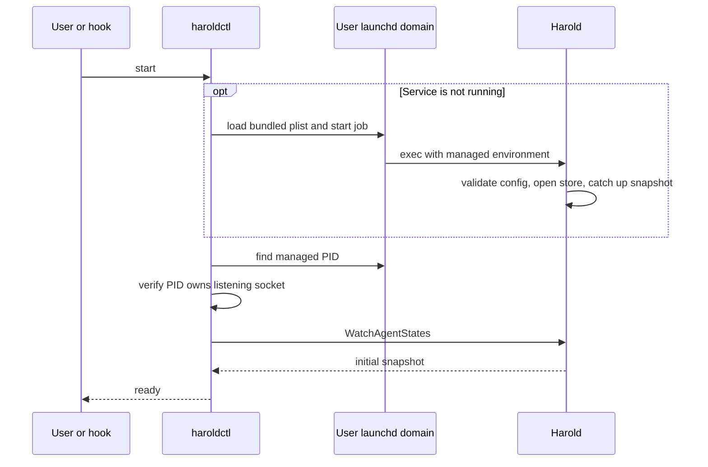

# Operation

Harold runs as a per-user service on macOS. The installer provides `haroldctl` to start, stop, restart, and check that service. It does not register automatic startup at login.

## Problem

A listening port alone does not tell you which Harold process owns it or which configuration and database it uses. Starting a second daemon from a hook can also race the first process. Installation and hook startup therefore use one service owner and the same readiness check.

## Architecture

The installed `service.plist` stays inside the Harold bundle. `haroldctl start` loads it into the current user's graphical launchd domain and starts the service on demand. Its launcher applies the managed environment and replaces itself with the Harold binary. The service remains in that login session until stopped; the plist is not placed in `~/Library/LaunchAgents`.

| Component | Responsibility |
| --- | --- |
| Installer | Build, stage, sign, validate, replace files, and verify startup |
| `haroldctl` / `service.py` | Serialize control operations and manage the exact launchd service |
| gRPC server | Accept hook reports and stream current agent snapshots |
| Agent monitor | Resolve agent identity and record lifecycle/screen observations |
| Event handler | Project state, stage delivery work, and dispatch notifications/replies |
| Channel listener | Collect incoming messages for the event stream |

The runtime components share Harold's store and shutdown signal. See [Harold Architecture](../../explanations/architecture.md) for their data flow.

## Installation commands

Run these from the repository:

| Command | Behavior |
| --- | --- |
| `./scripts/install.sh` | Install or replace programs; retain existing local settings and managed data |
| `./scripts/install.sh --reinstall` | Archive the old bundle; retain settings and create fresh managed data |
| `--config PATH` | Import local TOML settings instead of retaining or prompting for them |
| `--prefix PATH` | Set executable directory; defaults to `~/bin` |
| `--signing-identity ID` | Choose a signing identity; defaults to ad-hoc `-` |
| `--offline` | Build with cached locked Cargo dependencies |

`make install` and `make deploy` call the normal installer. `make reinstall` selects fresh storage. Pass installer flags using `INSTALL_ARGS`. Missing prerequisites and invalid configuration stop installation before the running service is replaced. A readiness failure returns nonzero and reports where to find the installed log and configuration.

Reinstall operates only on the managed bundle. It does not convert database schemas or remove an external store mentioned in a copied configuration. Backups are named uniquely and their locations are printed. A normal install moves retained managed data into the new bundle; its archived previous bundle is not a second copy of that data.

## Configuration and environment

The daemon loads configuration in this order:

1. `config/default.toml`, required.
2. `config/local.toml`, optional user settings for an installed service.
3. `HAROLD__<SECTION>__<KEY>` environment overrides.

For a directly run binary, `HAROLD_CONFIG_DIR` selects the directory and `HAROLD_ENV` selects the overlay name. By default, configuration is adjacent to the executable.

The installed service controls its own config directory, `local` overlay, PATH, UTF-8 locale, and store at `<prefix>/harold/data/events`. It clears inherited Harold settings overrides before applying that environment. This keeps startup, configuration checks, readiness checks, and hooks pointed at the same installation even when the invoking shell contains development overrides.

`service.json` records the service identity and environment. Channel credentials belong in `config/local.toml`, which the installer writes with owner-only permissions. Edit that file and run `haroldctl restart` to apply changes.

## Start, stop, and inspect

For the default installation:

```sh
~/bin/haroldctl start
~/bin/haroldctl status
~/bin/haroldctl restart
~/bin/haroldctl stop
```

`start` is idempotent. It succeeds only when the launchd service's PID owns the configured listening socket and a read-only gRPC request receives the initial `WatchAgentStates` snapshot. It does not use `TurnComplete` or notification diagnostics as a probe. An unrelated listener is an error, not a process to kill.

Hooks call the same `start` operation before sending a completion. They use the managed endpoint and do not spawn a daemon directly.


```mermaid
sequenceDiagram
    participant Caller as User or hook
    participant Control as haroldctl
    participant Launchd as User launchd domain
    participant Harold
    Caller->>Control: start
    opt Service is not running
        Control->>Launchd: load bundled plist and start job
        Launchd->>Harold: exec with managed environment
        Harold->>Harold: validate config, open store, catch up snapshot
    end
    Control->>Launchd: find managed PID
    Control->>Control: verify PID owns listening socket
    Control->>Harold: WatchAgentStates
    Harold-->>Control: initial snapshot
    Control-->>Caller: ready
```

## Shutdown

`haroldctl stop` unloads the exact service and waits for its process to stop within a bounded period. Within Harold, SIGINT or SIGTERM closes the shared shutdown signal, ends snapshot streams, drains in-flight RPCs, and joins the event handler and listener. The monitor has a bounded shutdown deadline.

An RPC that appends after the handler has stopped remains durable and is projected at the next start. Event-stream and state-database writes commit as operations complete; shutdown does not require a separate final checkpoint.

## Read-only daemon checks

| Command | Result |
| --- | --- |
| `harold --check-config` | Validates resolved configuration and prints only `grpc_addr` and `store_path` as JSON; does not open storage |
| `harold --check-ready` | Receives one snapshot within five seconds and prints `ready` and `through_event_version`; does not print pane contents or append events |

These direct commands use the invoking process's normal configuration environment. `haroldctl status` runs the readiness check with the installed environment and adds process ownership verification.

## Notification diagnostics

`harold --diagnostics [--delay N]` explicitly tests screen-lock detection, TTS, and the selected away channel. It can speak or send a message. A bare `--delay` defaults to ten seconds, allowing time to lock the screen.

Use diagnostics only when intentionally testing notification delivery. See [installation and setup](../../how-tos/setup.md) for the manual macOS permissions and provider-hook steps that remain after the service is ready.

## Inventory timeout

If the dashboard reports `MONITOR DEGRADED inventory:timeout`, check
`~/bin/harold/harold.log` for the component's failure and recovery messages.
Inventory scans can take longer when macOS schedules Harold in the background.
The inventory deadline defaults to 3000 ms and can be overridden in local.toml:

```toml
[agent_monitor]
inventory_timeout_ms = 5000
```

Restart with `~/bin/haroldctl restart` after changing it. This controls process
inventory scanning and identity resolution; screen captures retain their 500 ms
deadline. A worker still finishing after a timeout is not launched again; the
previous health state and panes remain until another acquisition completes.
