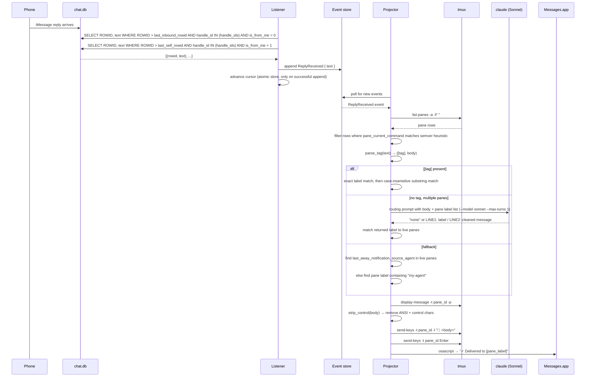

# Reply Routing

Reply Routing routes inbound iMessage replies to the correct agent session running in a tmux pane.

## Problem

Replying from your phone means you know which agent you meant but the message arrives as plain text with no session context. With multiple agent sessions running, there is no obvious way to get your reply to the right one.

## Architecture

Routing has two stages: inbound collection and routing resolution.

**Inbound collection** — The listener watches `chat.db` for filesystem changes (via FSEvents on macOS) and runs two separate queries on each change, each with its own ROWID cursor. A 5-second fallback poll ensures messages are still detected if the filesystem watcher is unavailable:

- **Inbound** — `handle_id IN (handle_ids) AND is_from_me = 0` — messages sent by the user from the recipient's device
- **Self** — `handle_id IN (handle_ids) AND is_from_me = 1` — messages sent from the user's phone that appear as self-sent rows in chat.db

Each cursor is advanced only after a successful `append_reply_received`, so a crash before the append causes the message to be reprocessed on the next poll rather than skipped.

**Routing resolution** — The projector consumes `ReplyReceived` events and calls `route_reply()`. Live pane discovery runs at resolution time via `tmux list-panes -a`, filtering to panes whose `pane_current_command` matches the Claude Code process heuristic (process name is a semver string of digits and dots, e.g. `20.11.0`). Agents are addressed via the `AgentAddress` enum (currently only `TmuxPane { pane_id, label }`).

## Pane discovery

Claude Code runs under a node process named after the node version (e.g. `20.11.0`). Harold detects this by checking that the process name consists entirely of digit-separated numeric segments (at least 3 parts). This is a heuristic — a future improvement is explicit pane registration via the `TurnComplete` RPC.

Pane label format: `<session_name>:<window_index>.<pane_index>` (e.g. `alir-app main:0.1`).

## Routing resolution

```
route_reply(text)
│
├─ parse_tag(text) → ([tag], body)
│
├─ tag present?
│   ├─ exact match on pane label → use it
│   └─ substring match (case-insensitive) → use it
│       └─ no match → return None (error iMessage)
│
├─ no tag → semantic_resolve(body, panes)
│   ├─ only 1 pane → skip (returns None, falls through)
│   └─ multiple panes → AI CLI (Sonnet, --max-turns 1, disableAllHooks)
│       prompt asks: "does this message have EXPLICIT routing intent?"
│       ├─ response = "none" → return None
│       └─ response = LINE1: pane label / LINE2: cleaned message → match by label
│
├─ last_away_notification_source_agent → find AgentAddress in live panes
│
└─ my-agent fallback → find pane whose label contains "my-agent"
```

## Delivery

Once a pane is resolved:

1. `is_pane_alive(pane_id)` — re-checks `tmux display-message -t <pane_id> -p #{pane_current_command}` to confirm still a Claude Code process
2. `strip_control(text)` — removes ANSI escape sequences and non-newline control characters
3. `tmux send-keys -t <pane_id> -l "📱 <body>"` — sends text literally (no shell interpretation)
4. `tmux send-keys -t <pane_id> Enter` — submits the message
5. Confirmation iMessage sent back: `"✓ Delivered to [<pane_label>]"`

If no pane is found, an error iMessage lists the currently available pane labels.

## Semantic routing prompt

The AI CLI is invoked with Sonnet (`--max-turns 1`, `--settings '{"disableAllHooks":true}'`) with this prompt structure:

```
You are a routing classifier. Do NOT answer or respond to the message content.

MESSAGE TO CLASSIFY:
<message>
<body (with </message> tags stripped for injection prevention)>
</message>

ACTIVE TMUX PANES:
- <label1>
- <label2>

Pane labels use hyphens where users may write spaces (e.g. 'my agent' refers to 'my-agent').
Does the message contain EXPLICIT routing intent to a specific pane?
(direct address like 'To X,', 'ask X', '[X]', 'my agent')
If yes, reply on two lines:
LINE1: exact pane label
LINE2: message with routing prefix removed
If no explicit routing intent, reply: none
```

The message body is wrapped in `<message>` tags with `</message>` occurrences stripped to prevent prompt injection. The cleaned message from LINE2 is what gets relayed to the pane, stripping any routing prefix the user included.

## Sequence


