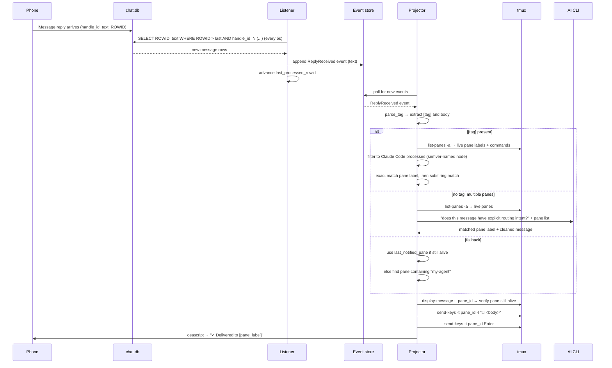

# Reply Routing

Reply Routing routes inbound iMessage replies to the correct agent session running in a tmux pane.

## Problem

Replying from your phone means you know which agent you meant but the message arrives as plain text with no session context. With multiple agent sessions running, there is no obvious way to get your reply to the right one.

## Architecture

The listener polls `chat.db` for new inbound messages and appends `ReplyReceived` events. The projector consumes those events and drives routing. Live tmux pane discovery is used at routing time — no stale registry.

```
chat.db (polling every 5s)
       │
       ▼
  Listener → ReplyReceived event
                    │
                    ▼
              ┌─────────────────────────────────────────┐
              │           route_reply()                 │
              │                                         │
              │  parse [tag] prefix                     │
              │  ├─ tag found → match live panes        │
              │  └─ no tag                              │
              │       ├─ multiple panes → AI CLI        │
              │       └─ single/no match                │
              │            ├─ last_notified_pane        │
              │            └─ my-agent fallback         │
              │                    │                    │
              │              no match found             │
              └─────────────────────────────────────────┘
                    │                    │
                    ▼                    ▼
            tmux send-keys         error iMessage
            + confirm iMessage
```

## Sequence



## Routing precedence

1. `[tag]` prefix in message — exact then substring match against live tmux pane labels
2. No tag, multiple panes — AI CLI determines routing intent from message content
3. No explicit routing — falls back to `last_notified_pane`
4. Final fallback — pane whose label contains `my-agent`
5. No match found — error iMessage sent back listing available panes

## Tag format

```
[pane-label] message text
```

The tag is matched case-insensitively as a substring, so `[main]` matches a pane labelled `alir-app main:0.1`.

## Delivery

- Message is relayed via `tmux send-keys` to the matched pane
- A confirmation iMessage is sent back: `✓ Delivered to [pane_label]`
- Pane liveness is verified before delivery; stale panes are reported back
