# Reply Routing

Reply Routing routes inbound iMessage replies to the correct agent session running in a tmux pane.

## Problem

Replying from your phone means you know which agent you meant but the message arrives as plain text with no session context. With multiple agent sessions running, there is no obvious way to get your reply to the right one.

## Architecture

Routing has two stages: inbound collection and routing resolution.

**Inbound collection** — The listener polls `chat.db` every 5 seconds for new rows where `handle_id` matches the configured sender(s) and `is_from_me = 0`. Each new message is appended as a `ReplyReceived` event and the `last_processed_rowid` is advanced atomically before appending, so a crash after advance skips the message rather than reprocessing it.

**Routing resolution** — The projector consumes `ReplyReceived` events and calls `route_reply()`. Live pane discovery runs at resolution time via `tmux list-panes -a`, filtering to panes whose `pane_current_command` matches the Claude Code process heuristic (process name is a semver string of digits and dots, e.g. `20.11.0`).

## Pane discovery

Claude Code runs under a node process named after the node version (e.g. `20.11.0`). Harold detects this by checking that the process name consists entirely of digit-separated numeric segments (at least 3 parts). This is a heuristic — a future improvement is explicit pane registration via the `TurnComplete` RPC.

Pane label format: `<session_name>:<window_index>.<pane_index>` (e.g. `alir-app main:0.1`).

## Routing resolution

```
route_reply(text)
│
├─ parse_tag(text) → ([tag], body)
│
├─ tag present?
│   ├─ exact match on pane label → use it
│   └─ substring match (case-insensitive) → use it
│       └─ no match → return None (error iMessage)
│
├─ no tag → semantic_resolve(body, panes)
│   ├─ only 1 pane → skip (returns None, falls through to last_notified_pane)
│   └─ multiple panes → AI CLI (Haiku, --max-turns 1, disableAllHooks)
│       prompt asks: "does this message have EXPLICIT routing intent?"
│       ├─ response = "none" → return None
│       └─ response = LINE1: pane label / LINE2: cleaned message → match by label
│
├─ last_notified_pane → find pane_id in live panes (verify still alive)
│
└─ my-agent fallback → find pane whose label contains "my-agent"
```

## Delivery

Once a pane is resolved:

1. `is_pane_alive(pane_id)` — re-checks `tmux display-message -t <pane_id> -p #{pane_current_command}` to confirm still a Claude Code process
2. `strip_control(text)` — removes ANSI escape sequences and non-newline control characters
3. `tmux send-keys -t <pane_id> -l "📱 <body>"` — sends text literally (no shell interpretation)
4. `tmux send-keys -t <pane_id> Enter` — submits the message
5. Confirmation iMessage sent back: `"✓ Delivered to [<pane_label>]"`

If no pane is found, an error iMessage lists the currently available pane labels.

## Semantic routing prompt

The AI CLI is invoked with Haiku (`--max-turns 1`, `--settings '{"disableAllHooks":true}'`) with this prompt structure:

```
Given this message: "<body>"

And these active tmux panes:
- <label1>
- <label2>

Does the message contain EXPLICIT routing intent to a specific pane?
(direct address like 'To X,', 'ask X', '[X]' — NOT just thematic association)
If yes, reply on two lines:
LINE1: exact pane label
LINE2: message with routing prefix removed
If no explicit routing intent, reply: none
```

The cleaned message from LINE2 is what gets relayed to the pane, stripping any routing prefix the user included.

## Sequence

```mermaid
sequenceDiagram
    participant Phone
    participant ChatDb as chat.db
    participant Listener
    participant Store as Event store
    participant Projector
    participant Tmux as tmux
    participant AiCli as claude (Haiku)
    participant Messages as Messages.app

    Phone->>ChatDb: iMessage reply arrives
    Listener->>ChatDb: SELECT ROWID, text WHERE ROWID > last_rowid AND handle_id IN (?) AND is_from_me = 0
    ChatDb-->>Listener: [(rowid, text), ...]
    Listener->>Listener: advance last_processed_rowid (atomic store)
    Listener->>Store: append ReplyReceived { text }

    Projector->>Store: poll for new events
    Store-->>Projector: ReplyReceived event

    Projector->>Tmux: list-panes -a -F "#{pane_id}|#{session_name}:#{window_index}.#{pane_index}|#{pane_current_command}"
    Tmux-->>Projector: pane rows
    Projector->>Projector: filter rows where pane_current_command matches semver heuristic

    Projector->>Projector: parse_tag(text) → ([tag], body)

    alt [tag] present
        Projector->>Projector: exact label match, then case-insensitive substring match
    else no tag, multiple panes
        Projector->>AiCli: routing prompt with body + pane label list (--model haiku --max-turns 1)
        AiCli-->>Projector: "none" or LINE1: label / LINE2: cleaned message
        Projector->>Projector: match returned label to live panes
    else fallback
        Projector->>Projector: find last_notified_pane in live panes
        Projector->>Projector: else find pane label containing "my-agent"
    end

    Projector->>Tmux: display-message -t pane_id -p #{pane_current_command} → liveness check
    Projector->>Projector: strip_control(body) → remove ANSI + control chars
    Projector->>Tmux: send-keys -t pane_id -l "📱 <body>"
    Projector->>Tmux: send-keys -t pane_id Enter
    Projector->>Messages: osascript → "✓ Delivered to [pane_label]"
```


